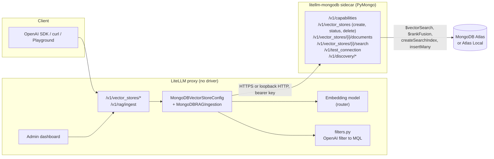

# MongoDB Atlas Vector Search for LiteLLM: Path A design

Scope: Dimension 1 only (Atlas Vector Search as a first-class LiteLLM vector store), delivered by extending the upstream sidecar architecture so the work is mergeable into `BerriAI/litellm` and `BerriAI/litellm-mongodb`. Everything is tested on a local instance before any PR.

Baselines:
- `BerriAI/litellm` main at `bfc805b` (2026-09-20), cloned at `/Users/mgm/code/litellm-mdb`.
- `BerriAI/litellm-mongodb` main at `d31ff3e`, cloned at `/Users/mgm/code/litellm-mongodb`. 400 lines of Python: FastAPI app, one search endpoint, pydantic models, error translation.

## Status (2026-09-20)

Local rig is up and the create, ingest, and search chain is proven end to end without a cloud MongoDB account.

| Item | State |
|---|---|
| Atlas Local 8.2 (Docker), Postgres (Docker), sidecar from source on :8080, litellm bootstrapped | Running; see `dev/mongodb/README.md` |
| Sidecar PR 1 scope: capabilities, create, status, delete (flag-gated), documents ingest, file delete, test_connection | Implemented on branch `feat/v0.2-create-ingest-test-connection` in `../litellm-mongodb`; 43 unit tests + 1 live integration test pass; ruff clean; README rewritten for v0.2 |
| LiteLLM PR 3 scope: create via sidecar, `MongoDBRAGIngestion` registered, base-class create hook with `litellm_params`, 404/405/409 error mapping, manifest flags | Implemented on branch `feat/mongodb-vector-store-v2`; 190 MongoDB unit tests + 260 related tests pass; basedpyright budget gate passes |
| SDK smoke against the live rig (`dev/mongodb/smoke_sdk.py`) | Passes with a hash-based stand-in embedding; switches to real embeddings once `OPENAI_API_KEY` is in `.env` |
| Sidecar PR 2 (filters with allowlist + index-aware field check, score threshold, exact, hybrid via `$rankFusion`, text index on create, result attributes, discovery endpoints) | Committed `ce1196e`; 70 unit tests + live integration (hybrid exercised on 8.2.11) pass |
| LiteLLM filters and ranking (OpenAI filter TypedDicts, pure translator to MQL, `ranking_options.score_threshold`, `ranker: hybrid`, `mongodb_text_index`, `mongodb_hybrid_search`, `mongodb_hybrid_weights`, `mongodb_exact_search`, `mongodb_score_threshold`, `attributes` in results, `custom_metadata` to chunk metadata, content-hash file ids) | Implemented; 224 MongoDB unit tests pass; live smoke with router embeddings passes filtered + thresholded search |
| LiteLLM PR 4: `POST /vector_store/test_connection` and `POST /vector_store/discover` (proxy admin only; saved store or unsaved config; redaction sentinel keeps saved secrets; embedding probe runs through the proxy router), provider hooks `atest_connection` / `adiscover` on the base config, MongoDB implementation merging LiteLLM checks (sidecar reachable, auth + capabilities, embedding dimensions, hybrid prerequisites) with the sidecar checklist | Implemented; 383 tests pass across MongoDB unit + vector store endpoint suites; live: all-green checklist on the saved store, and a wrong-model run reports "returns 3072 dimensions but the index expects 1536" |
| PR 5 (dashboard) | Not started |
| Production deployment (`~/code/openllm`, Terraform) | Live since 2026-09-20: gateway/backend images `mongodb-v2-2adfac28` from branch `deploy/mongodb-v2-1.101.0` (v1.101.0 + this work), sidecar `v0.2.0-c659fc6` as Cloud Run service `css-mongodb-sidecar-test`, Atlas Cluster0 (M20, MongoDB 9.0.1, GCP CENTRAL_US) with a user scoped to the `knowledge` database and namespaces limited to `knowledge.*`. Store `company_handbook` registered through the API, both sample policies ingested, plain/filtered/hybrid search and an all-green Test Connection verified against https://litellm.augment-code.support |
| Adversarial review (2026-09-20) | LiteLLM branch: 9 findings, 8 fixed, 1 cleanup deferred (`8d72b90`). Sidecar branch: security + correctness reviews found 1 critical (no namespace scoping), 5 high (filter `$not` bypass, ungated document deletes vs advertised flags, unbounded timeouts, unbounded vectors/bodies, discovery sample text), 14 medium, 9 low; all critical/high/medium and most lows fixed with regression tests (85 unit + live integration pass) |
| Commits | Sidecar: `7e8bffc`, `ce1196e`, hardening commit after review. LiteLLM: `b40c1c1`, `5656e6e`, `8d72b90` (review fixes), `7fa0068`/`0b7fc3b` (dev rig) |

Embeddings: the cloud LiteLLM router (`UPSTREAM_LITELLM_API_BASE`/`_KEY` in `.env`) now serves `text-embedding-3-small`, `text-embedding-3-large`, and `gemini-embedding-2`; LM Studio's `text-embedding-nomic-embed-text-v1.5` is the offline alternative. The proxy path is proven with real embeddings: register via `POST /vector_store/new`, `POST /v1/rag/ingest` twice, `POST /v1/vector_stores/{id}/search` returns the right chunk first.

### Upstream UX defects found while testing (candidates for PR 4/5 or separate small PRs)

1. **Config-registered stores vanish after a list.** With a database connected, `GET /vector_store/list` treats the DB as the source of truth and evicts in-memory stores that have no DB row, including ones from `vector_store_registry` in config. Opening the dashboard page triggers this. Fix: only evict stores that originated from the DB.
2. **Original filenames are discarded.** `_secure_uploaded_file` replaces the upload name with a random safe name and nothing keeps the original, so search results and the Files column show `debca7d….txt`. Fix: keep a sanitized display name alongside the safe name and pass it through to ingestion and file metadata.
3. **Failed ingests create a junk store row.** A failed `RAGIngestResponse` carries `vector_store_id: ""`, which passes the `None`/type guard in `_save_vector_store_to_db_from_rag_ingest`, so a row with an empty ID is written. Fix: also skip empty strings and `status == "failed"`.
4. **Info endpoint serves a stale in-memory copy.** `POST /vector_store/info` returned `vector_store_metadata: null` right after two successful ingests until a list call re-synced memory from the DB. Fix: read metadata from the DB when a client is available.
5. **Re-ingesting the same file duplicates chunks** (every ingest mints a fresh file id). Design choice needed: replace-by-filename option, or dedupe in the UI.
6. **`os.environ/` references in vector store params are never resolved.** Search tools resolve them at load (`proxy_server.py`, "Handle os.environ/ variables in litellm_params") but vector stores do not, so a saved `api_key: os.environ/MONGODB_SIDECAR_API_KEY` is sent to the provider literally. Workaround: omit `api_key` and rely on the provider's env fallback. Fix: resolve references in the shared registry load path for every provider.
7. **The 10-second DB sync never updates or removes stores.** `_init_vector_stores_in_db` calls `add_vector_store_to_registry`, which returns early when the id is already present, and nothing deletes ids missing from the DB. On multi-instance Cloud Run, an update or delete performed on one instance leaves the others serving the old registration until restart (seen live: ingest used stale params while Test Connection, which reads the DB, saw the new ones). Workaround: register under a new id. Fix: reconcile DB-sourced entries against the DB set on every sync, keeping config-sourced ones.
8. **Unknown store params without the `mongodb_` prefix are silently ignored** (`embedding_model`, `dimensions`, `filter_fields` typos surface only as "litellm_embedding_model is required" later). Fix: reject unknown keys outside the provider's known set plus the generic litellm params.

## 1. Where things stand today

| Layer | Exists | Gap |
|---|---|---|
| Sidecar (`litellm-mongodb`) | `POST /v1/vector_stores/{index}/search`, liveness, readiness, bearer auth, strong error translation | No create, no ingest, no filters, no score threshold, no hybrid, no index status, no discovery |
| LiteLLM adapter (`litellm/llms/mongodb/vector_stores/transformation.py`) | Search with client-side embedding, HTTPS/loopback enforcement, typed params, error mapping | Create raises. `filters`, `ranking_options`, `rewrite_query` are hard-rejected. Response drops `attributes` |
| RAG ingest (`litellm/rag/main.py` `INGESTION_REGISTRY`) | openai, bedrock, gemini, s3_vectors, vertex_ai | No `mongodb` entry, yet the dashboard already offers MongoDB in the ingest tab, so picking it returns a 400 today |
| Dashboard add form | MongoDB fields with tooltips, password field for the key, embedding-model combobox | No setup guidance block (pg_vector, valkey, vertex have one). No test connection. `(BETA)` baked into the display string leaks into table cells |
| Dashboard info page | Details + Test tab | `litellm_params` never shown, so database/collection/fields are invisible after save. Edit form is hard-filtered to Bedrock |
| Dashboard ingest tab | Drag-drop upload, per-file status | Embedding-model field renders as free text, and the `embedding_model` to `litellm_embedding_model` rename is skipped on this path. No chunking controls |
| Dashboard test tab | Chat-style search, score + content per result | Sends `{query}` only. No result count, filters, threshold, hybrid |
| Local test infra | Atlas Local image supports `$vectorSearch`, `$search`, `createSearchIndexes`, and `$rankFusion` (MongoDB 8.0+) | No compose file or seed data for a MongoDB dev loop |

## 2. Target architecture

Principles that keep it mergeable upstream:
- LiteLLM never imports a MongoDB driver. Embeddings are produced in LiteLLM, vectors travel over HTTP.
- Every new sidecar endpoint is additive and versioned through `GET /v1/capabilities`, so a new LiteLLM against the v0.1 sidecar degrades gracefully (search only) instead of failing.
- Filter translation is pure Python in LiteLLM (unit-testable without Mongo). The sidecar validates the resulting MQL against an operator allowlist before executing it.
- Secrets stay in the sidecar (connection string) or in `litellm_params` keys whose names the redaction masker already catches (`api_key`).

## 3. Sidecar v0.2 API (repo: `litellm-mongodb`)

All endpoints bearer-authenticated except health. Errors keep the existing `{error: {message, type: "mongodb_error", code}}` shape and status mapping (400 config, 401 auth, 408 timeout, 503 unavailable).

| Endpoint | Purpose | Notes |
|---|---|---|
| `GET /v1/capabilities` | `{version, features: {create, ingest, filters, score_threshold, hybrid, discovery, delete}, mongodb: {server_version, rank_fusion_supported}}` | LiteLLM and the dashboard adapt to this. Probes server version once at startup |
| `POST /v1/vector_stores` | Create collection if missing and a `vectorSearch` index: `{index_name, mongodb_database, mongodb_collection, mongodb_embedding_field, mongodb_text_field, dimensions, similarity: cosine or euclidean or dotProduct, filter_fields: [...], quantization?}` | Idempotent: same definition returns 200 with `status`; different definition returns 409 with a diff |
| `GET /v1/vector_stores/{index}` | `{index_name, queryable, status, definition, document_count}` | Powers a Ready/Building badge and the test-connection checklist |
| `DELETE /v1/vector_stores/{index}` | Drop the index; `?drop_collection=true` also drops the collection | Off by default via `MONGODB_SIDECAR_ALLOW_DELETE=false` |
| `POST /v1/vector_stores/{index}/documents` | Ingest: `{mongodb_database, mongodb_collection, file_id, filename, documents: [{chunk_index, text, embedding, metadata}]}` | Deletes existing chunks for `file_id`, then `insert_many`. Batched by LiteLLM (200 chunks per call). Stores `file_id`, `filename`, `chunk_index`, `ingested_at` alongside the text and vector so results carry real filenames |
| `DELETE /v1/vector_stores/{index}/documents/{file_id}` | Remove one file's chunks | |
| `POST /v1/vector_stores/{index}/search` (extended) | Adds `filter` (MQL, allowlisted operators), `score_threshold`, `exact`, `hybrid: {text_index, text_field, vector_weight, text_weight}`, `include_metadata` | Hybrid builds `$rankFusion` over `$vectorSearch` and `$search`; response gains `attributes` per result and `score_details` when hybrid |
| `POST /v1/test_connection` | Runs an ordered checklist and returns each step: sidecar auth, MongoDB ping, database visible, collection exists (doc count), index exists, index queryable, index dimensions (so LiteLLM can compare to the embedding model), sample document has embedding and text fields | This is the backbone of the dashboard experience |
| `GET /v1/discovery/collections?database=` and `GET /v1/discovery/indexes?database=&collection=` and `GET /v1/discovery/fields?database=&collection=` | Populate dropdowns and suggest field names (arrays of numbers are embedding candidates, long strings are text candidates) | Off by default; operators opt in with `MONGODB_SIDECAR_ALLOW_DISCOVERY=true` (decided after the security review); never returns document text, and the dashboard falls back to free-text fields when capabilities report `discovery: false`; requires only `listCollections`/`listSearchIndexes` privileges |

Implementation notes:
- Keep the current single-file structure but split by concern: `search.py`, `indexes.py`, `ingest.py`, `discovery.py`, `filters.py` (MQL allowlist validator), `capabilities.py`.
- Filter allowlist: `$eq $ne $gt $gte $lt $lte $in $nin $and $or $not`. Reject anything else with a 400 naming the operator. Filter keys must be in the index's `filter` fields; the sidecar reads the index definition once and caches it per index.
- `$rankFusion` requires MongoDB 8.0+ and an Atlas Search text index on the same collection. Report `hybrid: false` in capabilities when the server is older; the create endpoint can optionally create the text index when `hybrid_text_index` is requested.
- Tests: extend `tests/test_search.py` with an in-process fake backend for unit paths, plus an integration suite that runs against `mongodb/mongodb-atlas-local` in CI (GitHub Actions service container). Coverage targets: idempotent create, filter allowlist rejection, hybrid fallback, re-ingest replaces chunks, test-connection reports each failing step.

## 4. LiteLLM adapter changes (repo: `litellm`)

Files touched:

| File | Change |
|---|---|
| `litellm/llms/mongodb/vector_stores/transformation.py` | Implement `validate_create_vector_store`, `transform_create_vector_store_request/response` against `POST /v1/vector_stores`. Add `get_supported_openai_params` returning `filters`, `max_num_results`, `ranking_options`, and `map_openai_params` translating them. Send `filter`, `score_threshold`, `hybrid` to the sidecar. Parse `attributes` and `score_details`. Add a `capabilities()` fetch with a short in-memory cache, and downgrade to search-only behaviour with a clear error when the sidecar is v0.1 |
| `litellm/llms/mongodb/vector_stores/filters.py` (new) | Pure translator from the OpenAI filter schema (`{type: eq or ne or gt or gte or lt or lte or in or nin, key, value}` and `{type: and or or, filters: [...]}`) to MQL. First provider in the repo to validate the real OpenAI schema strictly |
| `litellm/types/vector_stores.py` | Add `VectorStoreComparisonFilter` and `VectorStoreCompoundFilter` TypedDicts next to the existing search types (they do not exist anywhere in the repo today). Add `VectorStoreTestConnectionResponse` with a list of `{check, status, message, details}` |
| `litellm/rag/ingestion/mongodb_ingestion.py` (new) | `MongoDBRAGIngestion(BaseRAGIngestion)`: `embed()` locally via router, `store()` ensures the index exists (calls create, idempotent), then batches `POST /v1/vector_stores/{index}/documents`. Returns `(index_name, file_id)`. Template: `s3_vectors_ingestion.py` (local embed + httpx store), not `openai_ingestion.py` |
| `litellm/rag/main.py` | Add `"mongodb": MongoDBRAGIngestion` to `INGESTION_REGISTRY`. This alone makes the existing dashboard ingest tab work for MongoDB |
| `litellm/llms/base_llm/vector_store/transformation.py` | Optional hook `async def atest_connection(litellm_params) -> VectorStoreTestConnectionResponse` with a default "not supported" result, so the proxy endpoint is provider-agnostic |
| `litellm/proxy/vector_store_endpoints/management_endpoints.py` | `POST /vector_store/test_connection` (proxy admin, mirrors `/health/test_connection` and `/search_tools/test_connection`): resolves `os.environ/` values from config, builds the provider config, runs the checklist, and adds a LiteLLM-side step that embeds a probe string with the chosen embedding model and compares its dimension to the index definition. `GET /vector_store/discovery/{kind}` proxies discovery to the sidecar for the selected `api_base` and key |
| `litellm/proxy/vector_store_endpoints/endpoints.py` | No change needed for search/create; `reject_caller_embedding_selection_params` already protects embedding selection |
| `provider_endpoints_support.json` (+ backup copy) | Flip `vector_stores_create` and `rag_ingest` to true for mongodb |
| `tests/unit/llms/mongodb/vector_stores/` | Extend the existing transformation test (it uses a `RecordingEmbeddingExecutor` and patched HTTP handlers). Add `test_filters.py` (pure), `test_create.py`, `test_ingestion.py`, and a v0.1-sidecar compatibility test |
| `tests/vector_store_tests/test_mongodb_vector_store.py` (new) | Subclass `BaseVectorStoreTest` (already exercises create + search) gated on `MONGODB_SIDECAR_API_BASE` |

New `litellm_params` (all validated in `_MongoDBSearchParams`, all non-secret so they display in the UI):
`mongodb_dimensions`, `mongodb_similarity`, `mongodb_filter_fields`, `mongodb_metadata_field`, `mongodb_hybrid_search`, `mongodb_text_index`, `mongodb_hybrid_weights`.

Repo conventions to honour (from `AGENTS.md` and the existing file): `Final` everywhere, frozen pydantic models, tuples over lists, no mutation, `# mutable-ok:` only with a reason, basedpyright and ruff strict gates via `make check`, proof of fix as curl output against a live proxy on port 4000 plus dashboard screenshots.

## 5. Dashboard experience

Design goal: an admin who has an Atlas cluster and a sidecar running should reach a working, verified vector store in under two minutes without reading docs. Every failure names the fix.

### 5.1 Add Vector Store dialog (MongoDB)

Progressive flow inside the existing `VectorStoreForm.tsx` dialog:

1. **Setup guidance block** (same `Alert` pattern as pg_vector and valkey, `VectorStoreForm.tsx:334-459`): one-paragraph explanation, a copyable `docker run` for the sidecar, and a docs link. Shown only when the provider is MongoDB.
2. **Connection section**: Sidecar URL, Sidecar API Key, and a **Test connection** button (pattern: `add_model/model_connection_test.tsx` and `search-tools/CreateSearchTools.tsx`). Result renders as a checklist with green/amber/red rows, each with a one-line fix, plus "Show details" and a copyable curl. Until the test passes, the sections below stay collapsed with a hint.
3. **Data section** (enabled after a successful test): Database and Collection as searchable comboboxes fed by discovery, with free-text fallback if discovery is disabled. Choosing a collection triggers field suggestions: Vector field and Text field comboboxes pre-selected from sampled documents, with the inferred dimension shown next to the vector field ("1536-dim, 12,480 docs").
4. **Index section**: radio "Use existing index" (dropdown of `vectorSearch` indexes on that collection, with Ready/Building status) or "Create new index" (name, similarity, filter fields multi-select, dimensions auto-filled from the embedding model by an embedding probe).
5. **Embedding model** combobox (existing) with an inline dimension check: green "matches index (1536)" or red "index expects 1536, this model returns 3072".
6. **Advanced** (collapsed): candidates considered (numeric input with validation), hybrid search toggle (shown only when capabilities report it) with text index picker and weight slider, score threshold default.
7. Save. The dialog closes to the table with the new row and a Ready/Building status chip.

Field-level changes needed: extend `VectorStoreFieldConfig` types with `number`, `boolean`, and `combobox-with-discovery`; add new field names to the `PROVIDER_FIELD_NAMES` allowlist and `vectorStoreShape` in `VectorStoreForm.tsx:62-84` (silent-drop trap); replace `MongoDB = "MongoDB (BETA)"` with a plain name plus `BetaBadge`; add a dark-mode logo treatment entry for `mongodb.svg` in `src/lib/logoTreatments.ts`.

### 5.2 Create Vector Store (ingest) tab

- Fix the two MongoDB bugs on this path: render the embedding-model field as the same combobox as the add dialog, and apply the `embedding_model` to `litellm_embedding_model` rename.
- Add chunking controls (chunk size, overlap) as a collapsible "Chunking" group; wire to `ingest_options.chunking_strategy`. Generic improvement, benefits every provider.
- Per-file progress already exists (Uploading, Ready, Error). Add chunk and vector counts to the success alert from the ingest response.
- Since the flow reuses the first `vector_store_id`, surface the created index name and a "Test it" link that opens the test tab with the store preselected.

### 5.3 Info page

- New **Connection** card showing redacted `litellm_params` (sidecar URL, database, collection, fields, embedding model, index status chip fetched from `GET /v1/vector_stores/{index}` via the proxy).
- **Test connection** action in the header, same checklist component.
- Fix the edit form so provider-specific params are editable for any provider (today it is hard-filtered to Bedrock at `vector_store_info.tsx:284-291`).
- **Files** card listing `ingested_files` with per-file delete (calls the documents delete endpoint).

### 5.4 Test Vector Store tab

- Query box plus a compact options bar: max results (slider 1 to 50), score threshold, hybrid toggle (when supported), and a **filter builder** (rows of key, operator, value with AND/OR grouping; keys come from `mongodb_filter_fields`).
- Results: score rendered as a proportional bar with the number, filename and chunk index as the title, text body, and attributes as chips. Hybrid results show the vector and text contribution from `score_details`.
- "Copy as curl" and "Copy as Python" for the current query so the admin can move from the UI to code.

### 5.5 Table and capability badges

- Provider column keeps the logo; add small capability chips ("Search", "Ingest", "Filters", "Hybrid") from a static capability map in the UI first, later from a backend `GET /vector_store/providers` endpoint.
- Status chip per MongoDB row: Ready, Building, Unreachable (from a lightweight status poll on hover or refresh).

### 5.6 Visual direction

Follow the dashboard's existing Tremor and shadcn components, `StatusBadge` tones, and the `model_connection_test` result layout so the feature looks native rather than bolted on. The MongoDB leaf logo needs the same dark-mode plate treatment as Valkey. All new strings go through the tooltip helper so every field has a one-line "why" like the existing MongoDB fields do.

## 6. Local test rig (before any PR)

Layout on this machine:

| Component | How it runs | Why |
|---|---|---|
| MongoDB | Docker: `mongodb/mongodb-atlas-local:8` (MongoDB 8.x with Vector Search, Atlas Search, and `$rankFusion`) | Same aggregation surface as Atlas, no cloud account needed. Also connect to a real Atlas cluster for final validation |
| Sidecar | From source on the host: `uv run uvicorn litellm_mongodb.app:create_app --factory --port 8080 --reload` with `MONGODB_CONNECTION_STRING` and `MONGODB_SIDECAR_API_KEY` | Hot reload while developing; loopback HTTP satisfies LiteLLM's HTTPS rule |
| Postgres | Docker, the existing `docker-compose.yml` `db` service | Needed for managed vector stores and the dashboard |
| LiteLLM proxy | From source per `AGENTS.md`: `python litellm/proxy/proxy_cli.py --config litellm/proxy/dev_config.yaml --detailed_debug --reload` on port 4000 | Serves the API and the built dashboard |
| Dashboard | `npm run dev` in `ui/litellm-dashboard` (port 3000) during UI work; `build_ui.sh` to bake into the proxy for screenshots | |
| Embedding model | Local via LM Studio's OpenAI-compatible endpoint (for example `nomic-embed-text`, 768-dim) registered as `openai/` with `api_base`, or an OpenAI key for `text-embedding-3-small` | Avoids cloud dependency for the loop; the dimension check in the UI is exercised either way |

Deliverables for the rig, kept out of the PRs or in a `dev/` folder:
- `dev/mongodb/docker-compose.yml` with Atlas Local and a healthcheck that waits for `mongot`.
- `dev/mongodb/seed.py`: creates `knowledge.policies`, ingests a few markdown files through `POST /v1/rag/ingest`, and prints a ready-to-run search curl. Also loads a filtered dataset (a `department` field) to exercise filters.
- `dev/mongodb/config.yaml` snippet for `vector_store_registry` with `api_key: os.environ/MONGODB_SIDECAR_API_KEY`.
- `dev/mongodb/smoke.sh`: create, ingest, search, filtered search, threshold, hybrid, delete, test-connection, each asserting on the JSON.
- Dashboard walkthrough recorded with the browser tool for screenshots that go into the PR descriptions.

Automated tests run in the loop: sidecar `uv run pytest`, LiteLLM `uv run --no-sync pytest tests/unit/llms/mongodb tests/test_litellm/vector_stores tests/test_litellm/proxy/vector_store_endpoints`, dashboard `npm run test:component -- <explicit paths>`, then `make check` before each PR.

## 7. PR sequence and effort

Forks: `litellm-mongodb` and `litellm` under your GitHub account, feature branches per PR. Upstream PRs reference each other; the LiteLLM PRs must work against sidecar v0.1 (graceful degrade) so they are not blocked on the sidecar release.

| # | Repo | PR | Contents | Effort |
|---|---|---|---|---|
| 1 | litellm-mongodb | Sidecar v0.2: capabilities, create, status, documents, test_connection | Sections 3 rows 1, 2, 3, 5, 6, 8 plus tests and README | 4 to 5 days |
| 2 | litellm-mongodb | Search extensions: filters, score threshold, exact, hybrid, discovery, delete | Remaining section 3 rows | 3 to 4 days |
| 3 | litellm | Adapter: create, ingest registry entry, filter types and translator, capabilities gating, tests | Section 4 except test_connection | 4 to 5 days |
| 4 | litellm | `POST /vector_store/test_connection`, discovery proxy, provider hook | Section 4 remaining rows | 2 days |
| 5 | litellm | Dashboard: add-dialog flow, ingest fixes, info page, test tab, badges | Section 5 | 5 to 7 days |
| 6 | litellm-docs | Provider page rewrite with screenshots and the compose snippet | | 1 day |

Total is roughly four to five weeks of focused work, with a usable local demo (search, create, ingest, filters through the existing UI) after PRs 1 and 3, around the end of week two.

## 8. Risks and mitigations

- **Maintainer appetite.** PR #40203 was reviewed by Greptile at 5/5 and merged in September 2026; the maintainers care about no driver in LiteLLM, strict typing, and proof-of-fix evidence. Path A respects all three. Open a short discussion issue on `litellm-mongodb` before PR 1 describing the v0.2 surface.
- **Discovery endpoints widen the sidecar's blast radius.** Gate them with an env flag, require least-privilege DB roles in the README, and never return document contents beyond one sampled field list.
- **Hybrid depends on MongoDB 8.0+ and a text index.** Capabilities gating keeps older clusters on vector-only search with a clear UI hint.
- **Index build latency.** Create returns `status: building`; ingest tolerates it, search returns the existing "not queryable yet" error, and the UI shows Building until the status poll flips.
- **Filter injection.** Translation happens in LiteLLM, the sidecar allowlists operators and keys, and both layers have negative tests.

## Appendix: Dimension 2 (parked)

MongoDB as LiteLLM's operational database was assessed and parked: Postgres is hard-pinned through 223 raw-SQL sites, 13 composite primary keys, advisory locks, SQL views, and native partitioning. The only viable route is a new backend behind the `litellm/repositories` protocol, a multi-month effort. The only cheap alternative is a MongoDB custom logger as a secondary sink for spend and request logs, with Postgres kept as the system of record.
